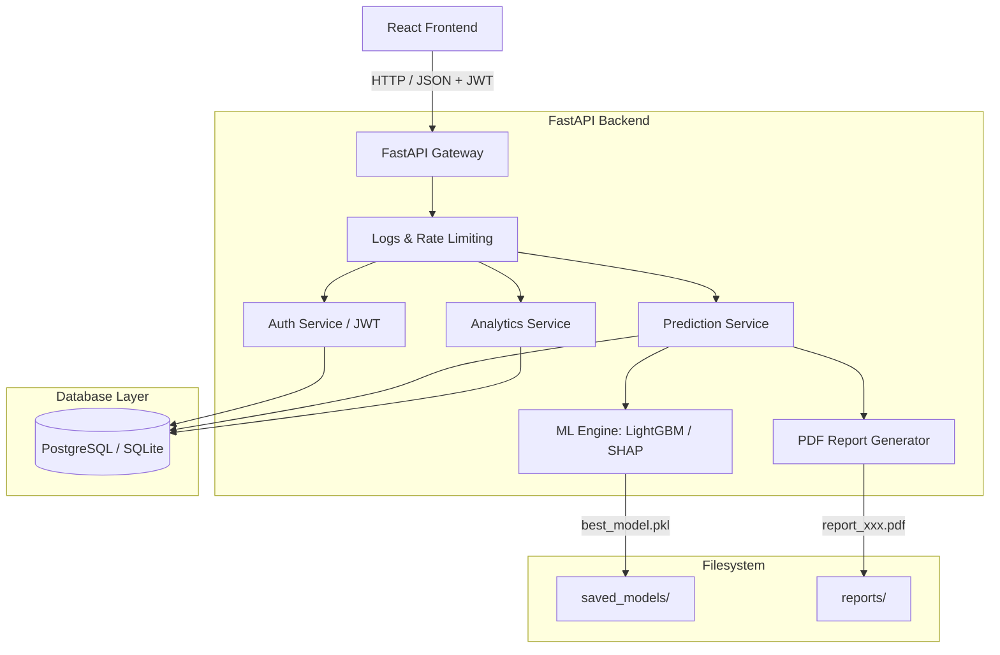

# Loan Approval Prediction & Risk Analytics Platform (Production Upgrade)

A production-grade credit risk prediction, analytics, and explainable AI (SHAP) assessment platform. 

This repository has been fully audited, debugged, and upgraded with a modular, highly performant tech stack:
* **Backend**: FastAPI (with structured logging, rate limiting, Pydantic validation, and JWT authentication).
* **Frontend**: React (v19) + TypeScript + Vanilla CSS (styled dark-theme design system, custom SVG interactive charts, borrower lists, and model metrics).
* **Database**: PostgreSQL (standard SQLAlchemy connection management with a portable local SQLite fallback).
* **ML Risk Engine**: Preprocessing pipeline with comparative metrics (Accuracy, Precision, Recall, F1, ROC-AUC) training Logistic Regression, Random Forest, XGBoost, and LightGBM, selecting the highest-performing model automatically.

---

## Project Layout

```text
├── backend/
│   ├── app.py             # FastAPI entrypoint, serving APIs and static frontend dist
│   ├── auth.py            # JWT authentication, session, and DB persistence services
│   ├── database.py        # SQLAlchemy connection configurations and dependency injectors
│   ├── middleware.py      # Structured request/response logging and Rate Limiting
│   ├── schemas.py         # Pydantic models for request/response serialization
│   ├── ml/
│   │   ├── analytics.py   # Dialect-aware SQL aggregation for dashboard charts
│   │   ├── data.py        # Preprocessing, data cleaning, and synthetic generation
│   │   ├── infer.py       # Inference services with safe fallback Tree SHAP evaluations
│   │   └── train.py       # Model training, validation grid, and DB sync pipelines
│   ├── reports/
│   │   ├── pdf_generator.py # Reportlab-based PDF credit report compiler
│   │   └── report_service.py # Report archiving and filesystem utility
│   ├── storage/
│   │   └── artifacts.py   # Model weights loading helper
│   └── scripts/
│       └── seed_db.py     # Python database dropping, recreating, and seeding script
├── database/
│   ├── schema.sql         # PostgreSQL schema definition DDL
│   └── seed.sql           # Raw SQL seed records
├── datasets/              # Generated datasets
├── frontend/
│   ├── src/
│   │   ├── App.tsx        # React routes, authentication wrapper, and custom SVG charts
│   │   └── index.css      # Dark-theme design system styling rules
│   ├── package.json       # React dependencies and scripts
│   └── vite.config.ts     # Vite bundler configuration
├── models/                # SQLAlchemy Model declarations (User, Borrower, Prediction, etc.)
├── saved_models/          # Trained model weights and metrics JSON
├── tests/                 # Pytest suite
│   ├── conftest.py        # SQLite temporary DB overrides and clients fixtures
│   ├── test_api.py        # Integration tests for FastAPI endpoints
│   └── test_ml.py         # Unit tests for ML pipeline
├── Dockerfile             # Multi-stage production frontend compiling + backend packaging
├── docker-compose.yml     # PostgreSQL + App container stack configuration
└── requirements.txt       # Python backend dependencies
```

---

## Architecture Diagram



---

## API Documentation

FastAPI automatically generates an interactive Swagger UI at `/docs` (and a Redoc at `/redoc`). A redirect is also mounted at `/swagger` for backward compatibility.

| Method | Endpoint | Description | Auth Required |
| :--- | :--- | :--- | :--- |
| `POST` | `/api/v1/auth/register` | Register an analyst account | No |
| `POST` | `/api/v1/auth/login` | Login and obtain JWT token | No |
| `POST` | `/api/v1/predict` | Predict risk probability and generate SHAP details + PDF | Yes (JWT) |
| `GET` | `/api/v1/dashboard-data` | Retrieve aggregates, trends, and recent logs for charts | Yes (JWT) |
| `GET` | `/api/v1/model-metrics` | Retrieve comparative metrics for all trained classifiers | Yes (JWT) |
| `GET` | `/api/v1/borrowers` | List all borrower profiles in the system | Yes (JWT) |
| `GET` | `/api/v1/audit-logs` | Retrieve system event audit logs (Admin only) | Yes (JWT - Admin) |
| `GET` | `/api/v1/health` | Check system status | No |

---

## Quick Start (Local Development)

### 1) Create Virtual Environment & Install Dependencies
Ensure you have Python 3.10+ and Node.js 18+ installed.

```bash
# Set up Python virtual environment
python -m venv venv
venv\Scripts\activate

# Install python dependencies
pip install -r requirements.txt

# Install npm packages in the frontend
cd frontend
npm install --legacy-peer-deps
cd ..
```

### 2) Database Setup & Seeding
By default, if no PostgreSQL configurations are found in environmental variables, the database engine will fall back to creating a local SQLite file named `loan_risk.db` in the repository root.

To seed the database with mock records (users, borrowers, predictions, and metrics):
```bash
python backend/scripts/seed_db.py
```
*Note: This script drops any existing tables and recreates them fresh before seeding.*

### 3) Train Models
Train Logistic Regression, Random Forest, XGBoost, and LightGBM, select the best model, and save model artifacts:
```bash
python train_model.py
```

### 4) Run Backend & Serve Statically
You can compile the frontend statically to allow FastAPI to serve it, or run them concurrently in development mode.

#### Option A: Serving both from FastAPI (Recommended)
1. Build the React frontend:
   ```bash
   cd frontend
   npm run build
   cd ..
   ```
2. Run FastAPI (serves the static frontend at `http://localhost:5000/` and APIs at `/api/v1/`):
   ```bash
   uvicorn backend.app:app --host 127.0.0.1 --port 5000 --reload
   ```

#### Option B: Concurrent Development (Vite Dev Server)
1. Run FastAPI backend on port 5000:
   ```bash
   uvicorn backend.app:app --host 127.0.0.1 --port 5000 --reload
   ```
2. Run Vite dev server in another terminal (runs frontend at `http://localhost:5173/`):
   ```bash
   cd frontend
   npm run dev
   ```

---

## Docker Launch (Production)

To run the complete PostgreSQL and multi-stage app container stack:

```bash
# Copy env template to .env
copy .env.example .env

# Build and run services
docker compose up --build
```
* The application will be accessible at: `http://localhost:5000/`
* Swagger docs will be accessible at: `http://localhost:5000/docs`
* PostgreSQL will be bound locally on port `5432`

---

## Testing

Run the pytest suite to verify ML pipeline functionality and API endpoint status codes:

```bash
pytest --cov=backend --cov=models tests/
```
*Note: The test suite uses a temporarySQLite database fixture to isolate test runs.*
